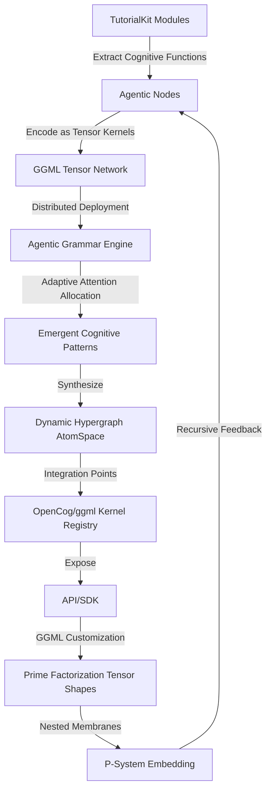

# Cognitive Architecture: Distributed GGML Tensor Network for TutorialKit

## 1. Cognitive Flowchart



---

## 2. Architecture Overview

**System Intelligence Layers:**

1. **Cognitive Extraction Layer**
   - Parse TutorialKit source for functions, modules, and dependencies.
   - Represent each as a cognitive "Node" for tensor encoding (Scheme DSL for hypergraph representation).

2. **Tensor Kernelization Layer**
   - Map each Node to a ggml tensor kernel.
   - Assign tensor dimensions:
     - Degrees of freedom = function arity × complexity depth
     - Shape: [inputs, outputs, state vectors, adaptation channels]

3. **Distributed Grammar Engine**
   - Compose kernels into a dynamic hypergraph.
   - Agentic grammar: each kernel exposes APIs for reasoning, pattern-matching, and activation spreading.

4. **Attention Allocation & Emergence**
   - ECAN-inspired scheduler distributes cognitive resources.
   - Activation flows through the network, guided by learned priorities and synergies.

5. **Integration & Embedding**
   - All kernels registered in ggml's kernel registry.
   - P-System: Nested membranes for modular, recursive cognitive boundaries.

---

## 3. Technical Architecture

```mermaid
graph LR
    subgraph TutorialKit
        T1[TypeScript Logic]
        T2[Astro Components]
        T3[MDX Tutorials]
    end

    subgraph "Cognitive Extraction Layer"
        CE1[Function/Module Parser]
        CE2[Hypergraph Encoder (Scheme)]
    end

    subgraph "Tensor Kernelization Layer"
        TK1[ggml Tensor Mapper]
        TK2[Tensor Shape Analyzer]
    end

    subgraph "Distributed Grammar Engine"
        GE1[Agentic Grammar API]
        GE2[Activation Propagator]
        GE3[Pattern Matcher]
    end

    subgraph "Attention Allocation"
        AA1[ECAN Scheduler]
        AA2[Synergy Optimizer]
    end

    subgraph "GGML Kernel Registry"
        KR1[Custom Kernels]
        KR2[Prime Factorization Shape DB]
    end

    subgraph "P-System Embedding"
        PS1[Nested Membrane Controller]
    end

    T1 --> CE1
    T2 --> CE1
    T3 --> CE1
    CE1 --> CE2
    CE2 --> TK1
    TK1 --> TK2
    TK2 --> GE1
    GE1 --> GE2
    GE1 --> GE3
    GE2 --> AA1
    GE3 --> AA2
    AA1 --> KR1
    AA2 --> KR2
    KR1 --> PS1
    KR2 --> PS1
    PS1 --> GE1
```

---

## 4. Recursive Implementation Pathways

#### Step 1: Cognitive Extraction (Scheme Example)
```scheme
(define (extract-cognitive-nodes repo)
  (map (lambda (file)
         (parse-functions-and-classes file))
       (repo-source-files repo)))
```

#### Step 2: Tensor Kernel Mapping
```scheme
(define (map-to-tensor-kernel node)
  (let ((arity (function-arity node))
        (complexity (compute-complexity node)))
    (make-ggml-tensor
      (shape: (list arity complexity)))))
```

#### Step 3: Hypergraph Pattern Encoding
```scheme
(define (add-to-hypergraph kernel)
  (hypergraph-add-node! global-atomspace kernel))
```

#### Step 4: ECAN Attention Allocation
```scheme
(define (allocate-attention kernel)
  (ecan-distribute! kernel (attention-weight kernel)))
```

---

## 5. Implementation Potential

- **Agentic Grammar:** Each TutorialKit component becomes a cognitive kernel—interfacing via dynamic agentic grammar APIs.
- **ggml Customization:** Kernels registered in ggml's registry, shapes derived from code complexity and interaction patterns.
- **Hypergraph Encoding:** All connections stored in a distributed AtomSpace, supporting recursive reasoning and pattern discovery.
- **P-System Embedding:** Nested cognitive membranes for modular, scalable growth, enabling emergent intelligence.

---

## 6. Next Steps

1. **Automate Extraction:** Build a parser to identify cognitive elements in TutorialKit.
2. **Map to Kernel Shapes:** Quantify tensor dimensions for each element.
3. **Register Kernels:** Integrate into ggml registry with unique factorization.
4. **Connect Attention Mechanisms:** Deploy ECAN-inspired scheduler.
5. **Document Everything:** Maintain recursive mermaid diagrams for all layers.

---

*This document encodes a vision of distributed cognitive architecture, where every implementation step recursively expands the intelligence and synergy of the TutorialKit ecosystem.*