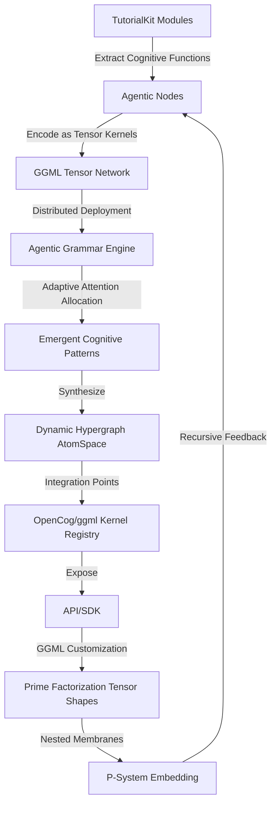

# Tutorial Autogeneration Engine - GitHub Action

This GitHub Action implements an automated issue creation system for the Distributed Agentic Cognitive Grammar Network, which serves as the foundation for TutorialKit's tutorial autogeneration engine.

## Overview

The action creates structured issues for six distinct phases of cognitive architecture development, each representing a self-similar fractal in the recursive refinement of the distributed agentic grammar network.

## Usage

The workflow can be triggered manually via GitHub's workflow dispatch feature:

1. Navigate to **Actions** → **Tutorial Autogeneration Engine - Create Phase Issues**
2. Click **Run workflow**
3. Configure the inputs:
   - **Create issues for all phases**: Whether to create all 6 phase issues (default: true)
   - **Prefix for issue titles**: Custom prefix for issue titles (default: "[Cognitive Architecture]")

## Created Issues

When executed, the action creates 7 issues:

### Phase Issues
1. **Phase 1**: Cognitive Primitives & Foundational Hypergraph Encoding
2. **Phase 2**: ECAN Attention Allocation & Resource Kernel Construction
3. **Phase 3**: Neural-Symbolic Synthesis via Custom ggml Kernels
4. **Phase 4**: Distributed Cognitive Mesh API & Embodiment Layer
5. **Phase 5**: Recursive Meta-Cognition & Evolutionary Optimization
6. **Phase 6**: Rigorous Testing, Documentation, and Cognitive Unification

### Meta Issue
7. **Meta-Issue**: Distributed Agentic Cognitive Grammar Network Implementation

## Issue Structure

Each phase issue contains:

- **Objective**: Clear statement of the phase's purpose
- **Sub-Steps**: Detailed checklist of implementation tasks
- **Success Criteria**: Measurable outcomes for phase completion
- **Dependencies**: Prerequisites and related phases
- **Labels**: Appropriate categorization for tracking

## Labels Applied

The action automatically applies relevant labels to each issue:

- `cognitive-architecture`: All issues
- `phase-N`: Specific phase number (1-6)
- `meta-issue`: For the summary issue
- `enhancement`: Feature development
- `tutorial-autogeneration`: Core functionality
- Additional specific labels per phase (e.g., `ecan`, `ggml`, `neural-symbolic`)

## Implementation Vision

This workflow embodies the first step toward creating a revolutionary tutorial autogeneration engine that:

- Bridges symbolic and neural computation
- Implements distributed cognitive architectures
- Enables recursive self-improvement
- Achieves emergent cognitive unity

## Technical Architecture

The issues created by this action guide the implementation of:

## Permissions

The workflow requires the following permissions:
- `issues: write` - To create issues
- `contents: read` - To access repository content

## Next Steps

After running this action:

1. Review and prioritize the created issues
2. Assign team members to specific phases
3. Begin implementation with Phase 1
4. Track progress through the issue checkboxes
5. Use labels and milestones for project management

This action represents the foundational step toward a truly emergent, self-improving tutorial generation system that will revolutionize how interactive coding tutorials are created and maintained.