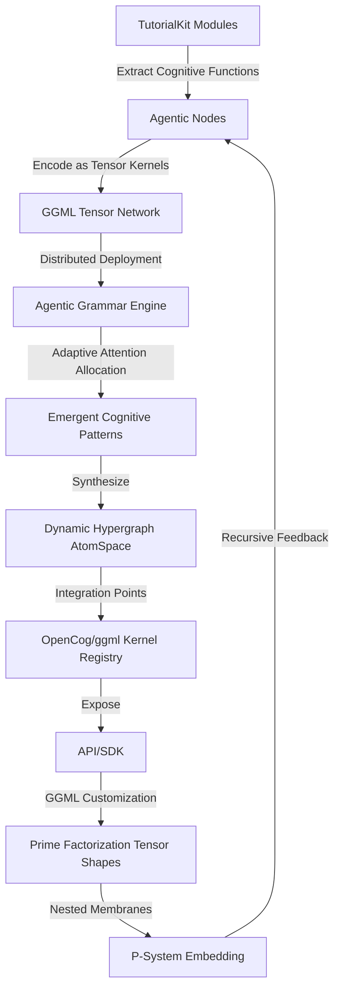

# Distributed GGML Tensor Network for TutorialKit

This document describes the implementation of a distributed GGML tensor network with agentic cognitive grammar for TutorialKit. This system transforms TutorialKit components into a cognitive processing network that can analyze, understand, and optimize tutorial content.

## Architecture Overview

The system consists of several interconnected layers:

### 1. Cognitive Extraction Layer

**Purpose**: Parse TutorialKit components and extract cognitive elements as nodes.

**Components**:
- `TutorialKitCognitiveExtractor`: Main extraction class
- `CognitiveNode`: Represents extracted cognitive elements

**Key Features**:
- Extracts nodes from tutorials, lessons, chapters, and parts
- Calculates complexity metrics for each component
- Builds connection graphs between related elements
- Supports hierarchical analysis

```typescript
import { TutorialKitCognitiveExtractor } from '@tutorialkit/types';

const extractor = new TutorialKitCognitiveExtractor();
const nodes = await extractor.extractNodes(lesson);
```

### 2. Tensor Kernel Mapping Layer

**Purpose**: Map cognitive nodes to GGML tensor kernels with optimized shapes.

**Components**:
- `TutorialKitTensorKernelMapper`: Maps nodes to tensor kernels
- `TensorKernel`: Represents tensor operations and data

**Key Features**:
- Prime factorization-based shape optimization
- Memory-aligned tensor dimensions
- Adaptive data type selection
- Automatic operation generation

```typescript
import { TutorialKitTensorKernelMapper } from '@tutorialkit/types';

const mapper = new TutorialKitTensorKernelMapper();
const kernel = await mapper.mapNodeToKernel(cognitiveNode);
const optimizedKernels = mapper.optimizeKernelShapes([kernel]);
```

### 3. Distributed Grammar Engine

**Purpose**: Process patterns through agentic grammar with attention allocation.

**Components**:
- `TutorialKitDistributedGrammarEngine`: Main processing engine
- `AgenticGrammar`: Grammar patterns and rules
- `AtomSpace`: Hypergraph representation

**Key Features**:
- ECAN-inspired attention allocation
- Pattern matching and processing
- P-System membrane evolution
- Hypergraph-based knowledge representation

```typescript
import { TutorialKitDistributedGrammarEngine } from '@tutorialkit/types';

const engine = new TutorialKitDistributedGrammarEngine(id, grammar, atomSpace);
await engine.processPattern(pattern, context);
await engine.allocateAttention(attentionWeights);
```

### 4. Tensor Network Architecture

**Purpose**: Integrate all components into a cohesive processing system.

**Components**:
- `TutorialKitTensorNetworkArchitecture`: Main orchestrator
- `CognitiveRegistry`: Component registry and lookup
- `TensorNetworkConfig`: Configuration management

**Key Features**:
- End-to-end processing pipeline
- Mermaid diagram generation
- Cognitive analytics and insights
- Recursive processing support

```typescript
import { TutorialKitTensorNetworkArchitecture } from '@tutorialkit/types';

const architecture = new TutorialKitTensorNetworkArchitecture();
await architecture.initialize(config);
const result = await architecture.processLessonContent(lesson);
```

### 5. Integration Layer

**Purpose**: Seamlessly integrate with existing TutorialKit components.

**Components**:
- `TutorialKitCognitiveIntegration`: Main integration interface
- Analytics and insights generation
- Visualization and reporting

```typescript
import { TutorialKitCognitiveIntegration } from '@tutorialkit/types';

const integration = new TutorialKitCognitiveIntegration(config);
await integration.initialize();

const lessonInsights = await integration.generateLessonInsights(lesson);
const tutorialInsights = await integration.generateTutorialInsights(tutorial);
```

## Cognitive Flowchart Implementation

The system implements the cognitive flowchart described in the issue:



## Key Features

### 1. Cognitive Node Extraction

The system can extract cognitive nodes from various TutorialKit components:

- **Tutorials**: Overall structure and organization
- **Parts**: High-level content groupings
- **Chapters**: Content sections and progressions
- **Lessons**: Individual learning units
- **Components**: Interactive elements
- **Functions**: Commands and operations

### 2. Tensor Kernel Optimization

Advanced tensor optimization includes:

- **Prime Factorization**: Optimizes tensor shapes using small prime factors
- **Memory Alignment**: Aligns dimensions for better memory access patterns
- **Shape Analysis**: Calculates optimal dimensions based on complexity and arity
- **Data Type Selection**: Chooses appropriate precision levels

### 3. Attention Allocation

ECAN-inspired attention mechanism:

- **Dynamic Allocation**: Distributes attention based on cognitive importance
- **Decay Mechanisms**: Implements attention decay over time
- **Propagation Rules**: Spreads activation through the network
- **Threshold Management**: Maintains optimal activation levels

### 4. P-System Evolution

Nested membrane processing:

- **Hierarchical Membranes**: Multiple processing contexts
- **Rule-based Evolution**: Object creation, destruction, and transformation
- **Charge Dynamics**: Energy-based membrane interactions
- **Recursive Processing**: Self-modifying cognitive structures

### 5. Hypergraph Representation

Advanced knowledge representation:

- **Concept Nodes**: Fundamental learning concepts
- **Relationship Edges**: Connections between concepts
- **Embedding Vectors**: Semantic representations
- **Index Structures**: Fast query and retrieval

## Usage Examples

### Basic Processing

```typescript
import { 
  TutorialKitTensorNetworkArchitecture,
  TutorialKitCognitiveIntegration 
} from '@tutorialkit/types';

// Initialize the system
const integration = new TutorialKitCognitiveIntegration({
  ggmlBackend: 'cpu',
  maxMemoryMB: 1024,
  attentionMechanism: 'ecan',
  membraneEvolution: true
});

await integration.initialize();

// Process a lesson
const lesson = {
  id: 'intro-lesson',
  data: {
    title: 'Introduction to React',
    mainCommand: 'npm start',
    focus: '/src/App.js'
  },
  // ... other lesson properties
};

const insights = await integration.generateLessonInsights(lesson);

console.log('Complexity Score:', insights.complexityScore);
console.log('Learning Paths:', insights.learningPaths);
console.log('Recommendations:', insights.recommendations);
```

### Advanced Analytics

```typescript
// Generate comprehensive tutorial analysis
const tutorial = {
  parts: { /* tutorial parts */ },
  lessons: [ /* tutorial lessons */ ]
};

const tutorialInsights = await integration.generateTutorialInsights(tutorial);

console.log('Learning Curve:', tutorialInsights.learningCurve);
console.log('Knowledge Graph:', tutorialInsights.knowledgeGraph);
console.log('Bottlenecks:', tutorialInsights.bottlenecks);
console.log('Optimizations:', tutorialInsights.optimizations);
```

### Custom Processing

```typescript
// Access the tensor network directly for custom operations
const tensorNetwork = integration.getTensorNetwork();

// Generate custom mermaid diagrams
const diagram = await tensorNetwork.generateMermaidDiagram('lesson');

// Access the cognitive registry
const registry = tensorNetwork.registry;
const allNodes = Array.from(registry.nodes.values());
const allKernels = Array.from(registry.kernels.values());
```

## Configuration Options

```typescript
interface TensorNetworkConfig {
  ggmlBackend: 'cpu' | 'cuda' | 'opencl' | 'metal';
  maxMemoryMB: number;
  attentionMechanism: 'ecan' | 'simple' | 'hierarchical';
  membraneEvolution: boolean;
  primeFactorization: boolean;
  recursiveExpansion: boolean;
}
```

## Mermaid Diagram Generation

The system automatically generates mermaid diagrams showing:

- **Cognitive Node Networks**: Relationships between extracted components
- **Tensor Kernel Graphs**: Tensor operations and data flow
- **Attention Flow**: Attention allocation and propagation
- **Learning Progression**: Complexity-based learning paths
- **Membrane Structure**: P-System membrane hierarchies

## Performance Considerations

- **Caching**: Automatic caching of processing results
- **Memory Management**: Configurable memory limits
- **Lazy Loading**: On-demand processing and computation
- **Batch Processing**: Efficient handling of multiple components

## Integration with TutorialKit

This system is designed to enhance existing TutorialKit functionality without breaking changes:

- **Optional**: Can be enabled/disabled per tutorial
- **Non-intrusive**: Existing APIs remain unchanged
- **Additive**: Provides additional insights and analytics
- **Extensible**: Easy to add new cognitive processing features

## Future Enhancements

- **GPU Acceleration**: CUDA and OpenCL backend support
- **Distributed Processing**: Multi-node tensor network deployment
- **Real-time Analysis**: Live tutorial optimization
- **Machine Learning**: Adaptive pattern recognition
- **Advanced Visualizations**: 3D cognitive maps and flows